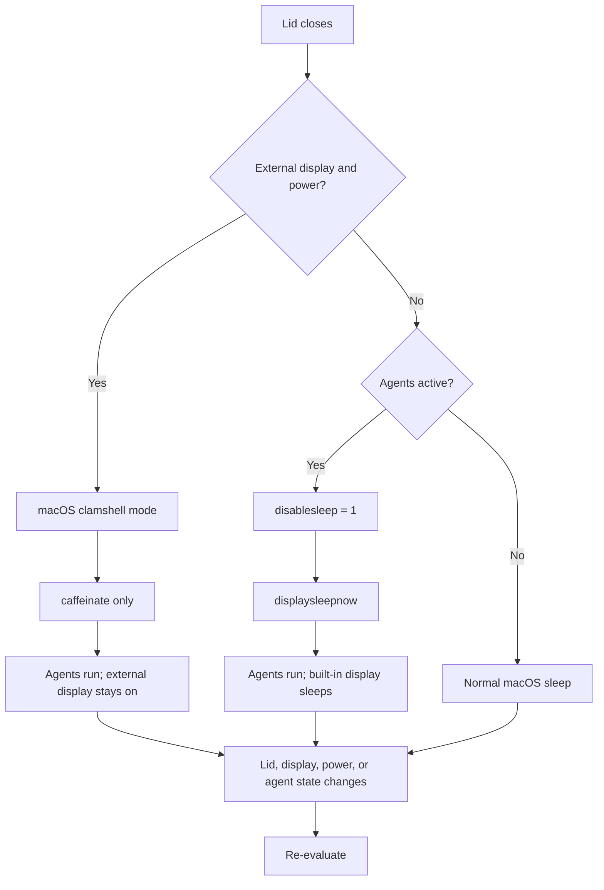

# Closed-lid power management

## Goal

Keep active agent work running while a MacBook lid is closed without changing
an attached external display. The built-in display is the only display that may
be put to sleep by SidePulse.

## Policy

- **Clamshell eligible** — the lid is closed, an external display is in use,
  the Mac has power, and its input accessories have been approved by macOS.
  Let macOS run clamshell mode. SidePulse keeps its normal `caffeinate -ims`
  assertion while agent work is active, but does not set `disablesleep` and
  does not request display sleep.
- **No external display, active agents** — pre-arm
  `pmset -a disablesleep 1` while the awake request is active, so macOS cannot
  sleep before the lid transition is observed. Once the lid is confirmed
  closed, issue `pmset displaysleepnow`. The former keeps the Mac awake; the
  latter lets the display sleep. Do not use `caffeinate -d` or `caffeinate -u`,
  which prevent or wake display sleep.
- **No external display, no active agents** — release the SidePulse
  `disablesleep` override and allow macOS to sleep normally.

`pmset displaysleepnow` is intentionally used only when no external display is
active: it is a global display-sleep request and cannot target only the
built-in panel.

SidePulse must not directly change framebuffer or panel power state. Those
private calls interfere with WindowServer's own lid-handling sequence.

## Crash history

A previous implementation called the private
`IOMobileFramebufferRequestPowerChange` API when the lid closed. WindowServer
then repeatedly failed its userspace watchdog check-in and was restarted. That
implementation was removed. This design uses only `pmset` and normal macOS
clamshell behavior.

## State flow

## Detection and transitions

Determine external-display presence from the CoreGraphics online display list,
not from `system_profiler`. A display that is not `CGDisplayIsBuiltin` counts
as external only when it is active. Re-evaluate after lid, power, and agent
updates, as well as each periodic status refresh. Treat a display-query failure
as unknown and do not issue `displaysleepnow` in that case.

Keep the no-external-display override armed until the awake request ends; this
avoids a race if the lid is closed again while agents are still working. Release
it when the request ends, or when an external display is active and the Mac has
power for clamshell mode. Do not explicitly wake a display; macOS handles that
through normal user activity and clamshell transitions.
